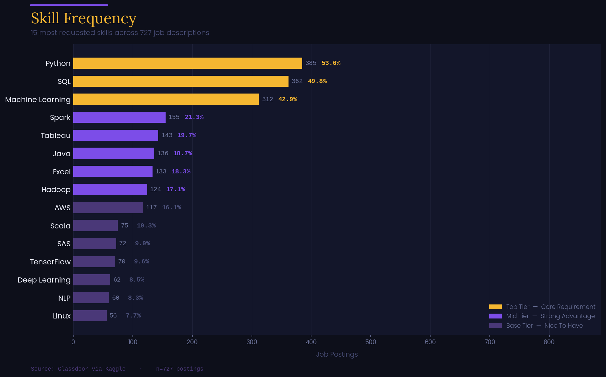
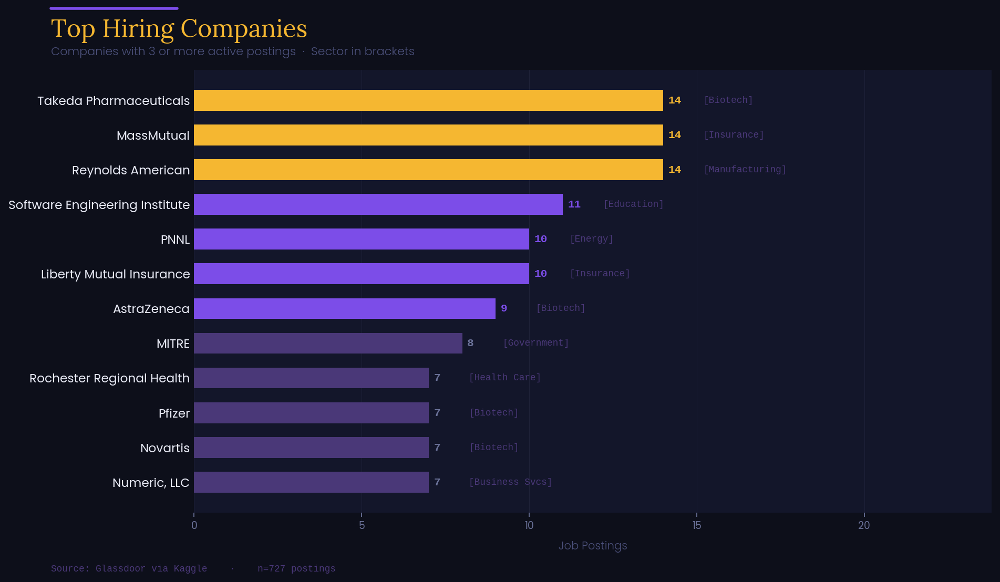
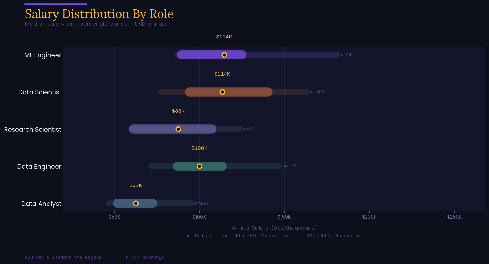
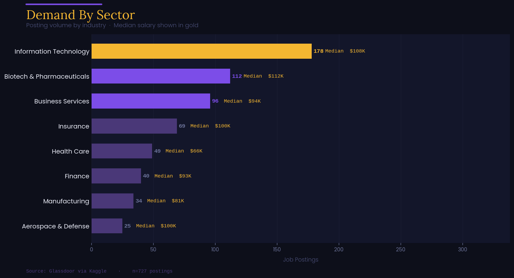
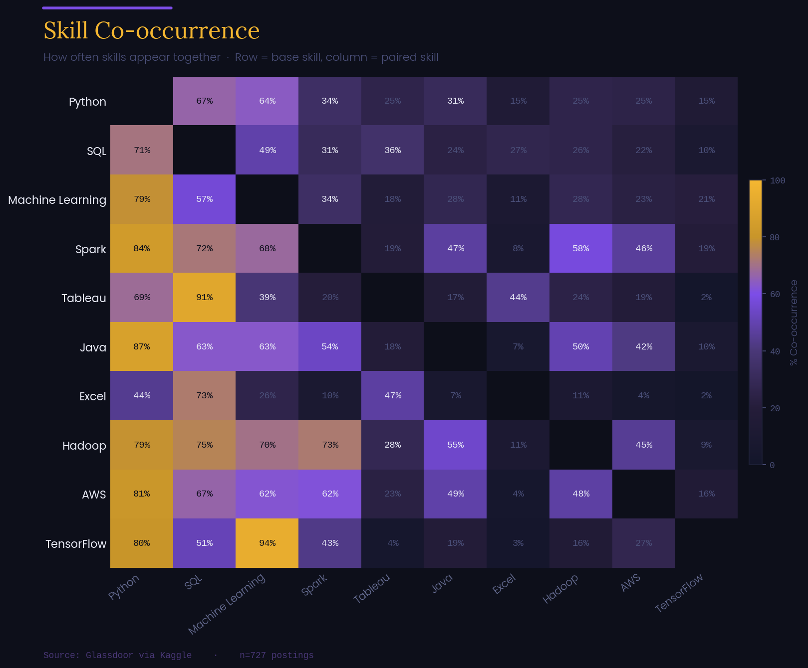

# IT & Data Job Market Analysis


I analyzed 727 real Glassdoor job postings to understand what the IT and data job market actually requires — not what bootcamps say it requires. Rather than relying on the dataset's five pre-tagged skill columns, I built a regex extraction pipeline to mine all 20 skills directly from raw job description text, then mapped salary distributions, hiring volume, and sector demand across five role categories.

---

## What The Data Says

**Python and SQL are the foundation, not the limit.** Python appears in 53% of job postings and SQL in 50%, roughly twice as often as the next tier of skills. Spark, Tableau, and Java follow in the 18–21% range. The gap between tier one and tier two is significant — if you haven't mastered Python and SQL, the rest of the stack doesn't matter yet.

**The salary ladder is clear and steep.** Median pay climbs from $62.5K for Data Analysts to $100K for Data Engineers, then to $113.5K for Data Scientists — an 82% jump from entry to mid-senior levels. This isn't about how long you've worked, but the complexity of the work: analysts interpret data, engineers build the infrastructure that moves it, and scientists model it. Each role demands a distinctly specialized skill set.

**Biotech and Pharma is the sleeper sector.** While Information Technology leads with 178 postings, Biotech & Pharmaceuticals ranks second with 112 — ahead of Business Services (96) and Insurance (69). Among the high-volume sectors, Biotech posts the highest median salary at $112K, edging out IT at $108K. Data skills clearly extend well beyond the tech industry.

---

## Visualizations

### Skill Frequency
*20 skills extracted via regex from raw description text — tiered by how often they appear*



---

### Top Hiring Companies
*Every company posting 3 or more roles, with their sector shown in brackets*



---

### Salary Distribution By Role
*Gold dot marks the median — the thick band is the IQR, the thin line spans P10 to P90*



---

### Demand By Sector
*Posting volume by industry with median salary overlaid — shows where volume and pay align*



---

### Skill Co-occurrence
*Read row to column: what percent of postings that mention the row skill also mention the column skill*



---

## How It Was Built

The dataset included binary flags for five skills (Python, R, Spark, AWS, Excel). I expanded this to 20 skills by creating regex patterns to extract terms like `machine learning`, `deep learning`, `natural language processing`, and cloud/DevOps tools that the original tagging missed.

Salary values were stored in thousands and required unit conversion. Company names contained embedded Glassdoor ratings (e.g. `Takeda Pharmaceuticals\n4.2`), which I stripped out. After removing salary outliers below $20K and above $280K and filtering invalid ratings, 727 of the original 742 postings remained.

The 256 unique job titles were grouped into five role buckets — Data Analyst, Data Engineer, Data Scientist, ML Engineer, and Research Scientist — using keyword matching. Salary ranges were calculated using the IQR/percentile method rather than mean and standard deviation to account for outliers and more accurately reflect the true median.

The skill co-occurrence matrix was created by taking the dot product of the binary skill flag columns and normalizing each row by its diagonal value to produce conditional percentages.

---

## Project Structure

```
IT-job-market-analysis/
├── notebook/
│   └── job_market_analysis.ipynb
├── data/
│   └── glassdoor_jobs.csv
├── charts/
│   ├── 01_top_skills.png
│   ├── 02_top_companies.png
│   ├── 03_salary_by_role.png
│   ├── 04_sector_demand.png
│   └── 05_skill_heatmap.png
└── README.md
```

---

## Run It Yourself

```bash
git clone https://github.com/prochefionallj/IT-job-market-analysis.git
cd IT-job-market-analysis
pip install pandas numpy matplotlib
jupyter notebook notebook/job_market_analysis.ipynb
```

---

## Data Source

[Glassdoor Jobs & Salaries — Kaggle](https://www.kaggle.com/datasets/rashikrahmanpritom/data-science-job-posting-on-glassdoor) · 742 postings with full job descriptions, company metadata, industry classification, and Glassdoor salary estimates.
